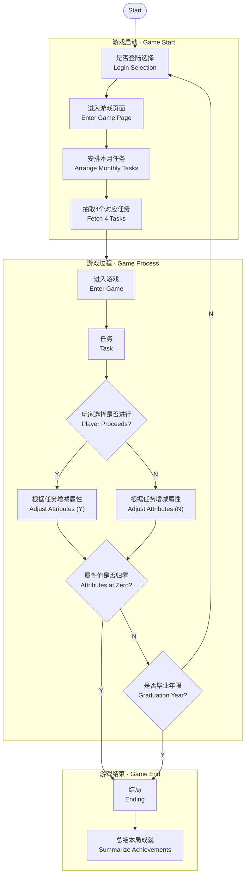

# Product Requirement Document
 
## Document Info
 
| Field | Details | Status |
|-------|---------|--------|
| Product Name | International Student Simulator | Draft |
| Author(s) | Shirly Yang, Boni He, Grace Liao | — |
| Last Updated | 24 March 2026 | Version 1.0 |
 
---
## Overview

 
## 1. Requirements
 
### 1.1 User Stories
 
| ID | User Story | Priority | Points |
|----|-----------|----------|--------|
| US-01 | As a player, I want to see a start screen with a "Start" button so that I can enter the game when I'm ready, rather than being dropped in immediately. | Must | [ 1–13 ] |
| US-02 | As a player, I want to see fixed tasks and random tasks each month, so that my decision making has a consistent structure while still feeling unpredictable enough to stay engaging. | Must | [ Points ] |
| US-03 | As a player, I want each task to have a clear category label so I can quickly assess which attributes a task affects and make more strategic decisions. | Must | [ Points ] |
| US-04 | As a player, I want the game to track my Intelligence, Money, and Health throughout the year, so that I can see how my choices accumulate over time and feel motivated to keep them balanced. | Must | [ Points ] |
| US-05 | As a player, I want to be able to accept or decline each task, so that I have meaningful agency over my monthly actions rather than passively executing everything presented to me. | Must | — |
| US-06 | As a player, I want the game to progress through a complete cycle, so that I experience the passage of time and feel the long-term consequences of my decisions building up. | Must | — |
| US-07 | As a player, I want to see my attribute changes summarised at the end of each decision, so that I can understand which tasks had a positive or negative impact and adjust my strategy going forward. | Must | — |
| US-08 | As a player, I want the game to calculate a final score based on my choices at the end of the year, so that I have a clear goal to aim for and can compare my performance across multiple runs. | Must | — |
| US-09 | As a player, I want to see a clear success or failure result and a restart option when the time is up, so that I understand how I performed and feel motivated to try again. | Must | — |
| US-10 | As a player, I want my overall playstyle to lead to different ending types, so that the game has higher replay value and I'm curious to discover what different strategies unlock. | Must | — |
| US-11 | As a player, I want to customise my character's appearance, so that I feel a stronger sense of ownership over my character throughout the game. | Must | — |
 
---
 
### 1.2 Feature Specifications
 
---
 
#### F-01 · Start Screen and Character Customisation
 
**Priority:** Must
**Developer:** Boni He, Shiying Yang
**Contact:** bhe783@aucklanduni.ac.nz, syan634@aucklanduni.ac.nz
 
**UI Elements:**
- Title: *International Student Simulator*
- Start button
- About Us button
- Sign In button
- Character selection: Academic Ace / Richmen / Fitness Fanatic / Average Person
 
---
 
#### F-02 · Monthly Task Selection
 
**Priority:** Must
**Developer:** Grace Liao
**Contact:** jila776@aucklanduni.ac.nz
 
**UI Elements:**
- Top: current month, remaining months until graduation
- Top text: initialised base info
- Left: three category buttons (Study / Entertainment / Social) + selected task progress
- Centre: study task selection (same layout applies to entertainment / social task selection)
- Right: display of tasks selected this month
- Drag-and-drop effect from task selection to selected tasks
 
---
 
#### F-03 · Task Interaction System
 
**Priority:** Must
**Developer:** Caspal Men
**Contact:** hmen498@aucklanduni.ac.nz
 
**UI Elements:**
- Title: Task In Progress
- Centre text: narrative description of the scenario
- Bottom left: two choice buttons
- Right: character illustration (swappable)
- Top: attribute bar
 
---
 
#### F-04 · Monthly Progression System
 
**Priority:** Must
**Owner:** Alvin Zhu
**Contact:** jzhu528@aucklanduni.ac.nz
 
**Description:**
After completing a month's tasks, display a monthly summary and attribute changes, then allow the player to proceed to next month's task planning.

**UI Elements:**
- Title: **"Monthly Summary"**
- Current month: e.g. "Month 3"
- Graduation progress: **X months remaining until graduation**
- Small calendar widget (left side)
- Centre info display:
  - Number of tasks completed this month (e.g. 5/5)
  - Icon info: attribute value changes (abstracted data, e.g. Intelligence good → well)
  - Presented in list form
 
---
 
#### F-05 · Ending Screen
 
**Priority:** Must
**Owner:** Ethan Hao
**Contact:** zhao761@aucklanduni.ac.nz
 
**Description:**
- Status: Happy Ending & Bad Ending (different themes)
- Show final status data: Intelligence, Money, Health (different numbers)
- Final score: Real score / Total score (default 100)
- Ending context
 
**Buttons:**
- **Play Again** — go back to start page
- **View Others** — go to leaderboard
 
---
 
#### F-06 · Multiple Endings
 
**Priority:** Must
**Owner:** Baiyi He, Shiying Yang
**Contact:** bhe783@aucklanduni.ac.nz, syan634@aucklanduni.ac.nz
 
**UI Layers:**
 
**Background Layer:**
- Desktop (wood texture)
- Decorations (books, coffee, paper, photos)

**Main Container — centred:**
- Header area
- Compendium content area (Grid)